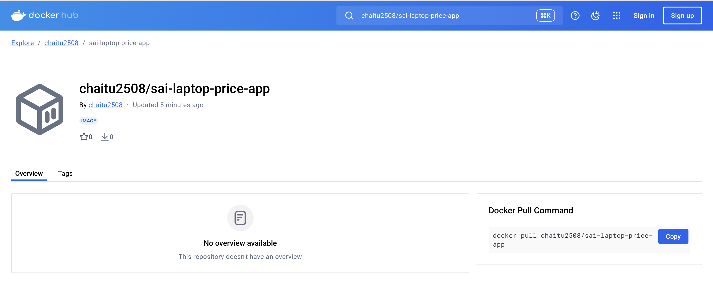

# LAPTOP PRICE PREDICTOR USING MACHINE LEARNING TECHNIQUES
   

## Problem Statement
The objective of this project is to create end to end machine learning model to predict prices of laptop based on given set of features. If a user who is not aware of  price of laptops, but knows the features by selecting the  desired features and configurations, we can predict the price using our website.

This is basically a regression problem.

## Steps involved

1. Data Preprocessing and cleaning
2. Exploratory data analysis
3. Feature Engineering
4. Modeling
5. Website/UI
6. Deployment in Cloud platform (Herouku)
      
  https://laptopprice.herokuapp.com/

## Machine Learning Models
XGboost,Voting Regressor,Catboost,Gradient boost,LightGBM,
Stacking,Random Forest,Extra Tree,Support Vector Regressor,Linear Regression,
Lasso Regression,Ridge Regression,Decision Trees,Ada boost,K-Nearest Neighbors.

## End Results
From the obtained results of the above models, XGBoost Classifier has highest model performance of 89.8%. So the model is saved to the file 'XGBoostRegressor.pickle.dat'

## Docker

1. create a Dockerfile
2. command to Build an image - docker build -t chaitu2508/sai-laptop-price-app .
3. command to run docker container - docker run -p 8501:8501 chaitu2508/sai-laptop-price-app

4. acces the app - Visit http://localhost:8501 in your browser.
5. To create/host our project a registory inside dockerhub:
a. docker login
b. docker push chaitu2508/sai-laptop-price-app

6. Now, Login to https://hub.docker.com
and search for this repository - `chaitu2508/sai-laptop-price-app`
